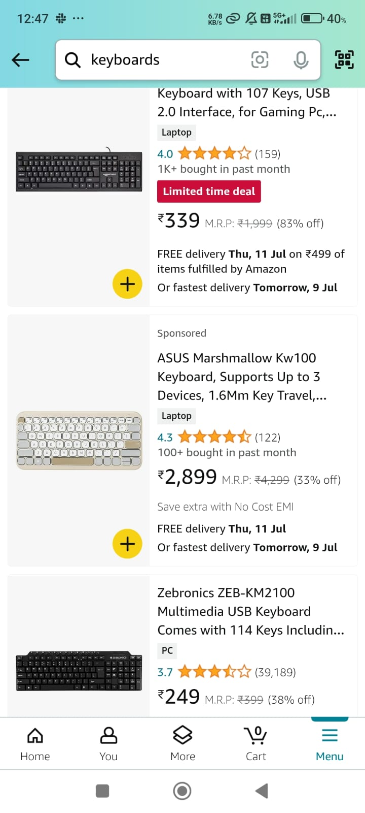
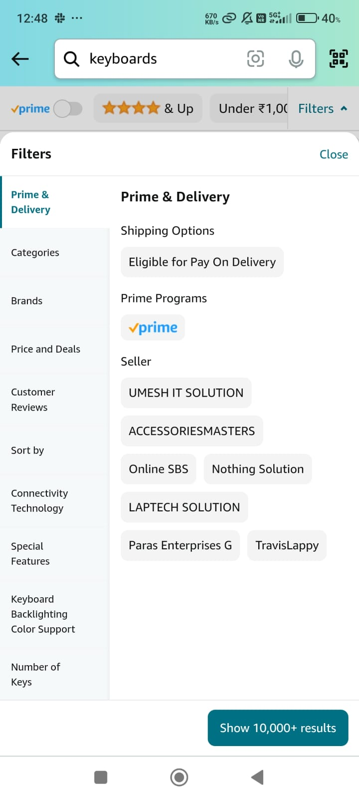

# Amazon: A Leading e-commerce platform worldwide

## Course Information
**Course Name:** Algorithmic Problem Solving  
**Course Code:** 23ECSE309  
**Name:** Prabhat Kumar Rai  
**University:** KLE Technological University  
**Portfolio Topic:** E-commerce

## Table of Contents
- [Introduction](#introduction)
- [Objectives](#objectives)
- [Challenges](#challenges)
- [Business Use Cases](#business-use-cases)
- [Learnings and Key Takeaways](#learnings-and-key-takeaways)

## Introduction
Delivering a seamless and efficient shopping experience is essential for customer retention and staying ahead in the competitive market. Amazon, a premier e-commerce platform offering a vast range of products, constantly innovates to enhance its user experience. This project targets the optimization of key business functionalities such as product search, filtering, inventory management, dynamic pricing, and shopping cart operations. By employing advanced algorithms and data structures, we can dramatically improve the performance and responsiveness of Amazon's platform, ensuring a smooth and enjoyable shopping experience for users. The driving force behind this project is the need to overcome common e-commerce challenges, including slow search performance, inefficient inventory management, and ineffective pricing strategies. With Amazon's extensive product catalog and substantial user traffic, robust solutions are necessary to maintain a competitive advantage and guarantee customer satisfaction.

## Objectives
The aim is to:
- use data structures for efficient memory management in business caese like product catalogue, wishlist and cart.
- use algorithms to improve time complexity for certain cases like product filtering and searching, order tracking.
- provide an overall seamless experience to user for all the cases.

This portfolio will showcase how advanced data structures and algorithms can revolutionize Amazon's e-commerce operations, ultimately leading to a engaging user experience.

## Challenges
Here's a list of tasks I plan to tackle for this portfolio project:
- **Research for Algorithms:** Explore different algorithms from the course syllabus (and beyond) to implement key functionalities.
- **Research for Data Structures:** Research appropriate data structures to efficiently store product catalog, and user data.
- **Evaluate Results:** Measure the performance of the system using various metrics, identify areas for improvement, and reflect on the algorithms and design choices.

## Business Use Cases

### 1. Product Catalog
**Use case:** Enabling fast and efficient autocomplete suggestions as users type product names or categories.

**Challenge:** Efficiently manage and query a large product catalog.  
**Algorithm:** Trie  
**Description:** A tree-like data structure that stores strings in a space-efficient way, allowing for fast retrieval of products based on prefixes.  
**Time Complexity:** O(L) for search, insert, and delete, where L is the length of the string.  
**Space Complexity:** O(N), where N is the number of characters in all the strings.  
**Approach:** 
- Use a trie to store product names or categories.
- Allows users to quickly find products by typing just a few characters, improving search speed and user experience.

### 2. Price Adjustments
**Use case:** Implementing dynamic pricing strategies based on factors like demand, time of day, or competitor prices.

**Challenge:** Adjust product prices dynamically based on various factors.  
**Algorithm:** Segment Tree or Binary Indexed Tree (Fenwick Tree)  
**Description:** Efficient data structures for handling range queries and updates.  
**Time Complexity:** O(log N) for both update and query operations.  
**Space Complexity:** O(N)  

**Approach:** 
- Use a segment tree or Fenwick tree to maintain and query price ranges.
- Allows for efficient dynamic price adjustments based on demand, supply, or promotional discounts.

### 3. Product Searching
**Use case:** Providing fast and relevant search results for millions of products based on user queries.

**Challenge:** Efficiently search products based on user queries.  
**Algorithm:** Binary Search  
**Description:** A classic algorithm for searching where elements are arranged in a sorted order.
**Time Complexity:** O(1) for adding documents, O(logN) for searching where N is the number of searchable items.  
**Space Complexity:** O(N), where N is the number of items.  

**Approach:** 
- Build a binary searh algorithm for searching product by names.
- Product names can be arranged in lexicograpically fashion.
- Could be used for quick keyword-based searching, enhancing the product search experience.

### 4. Product Filtering Based on different Metrics
**Use case:** Allowing users to quickly narrow down product selections based on multiple criteria like price range, brand, and ratings.

**Challenge:** Filter products based on various attributes (e.g., price, brand, ratings).  
**Algorithm:** Bloom Filter + Bitmask  
**Description:** Bloom filters provide a space-efficient probabilistic data structure for testing membership, and bitmasking is useful for managing multiple attributes.  
**Time Complexity:** O(1) for bloom filter checks, O(1) for bitmask operations.  
**Space Complexity:** O(N) for bloom filter, O(1) for bitmask.  

**Approach:** 
- Use a Bloom filter for fast membership checks of product attributes and bitmasking for combining multiple filter criteria.
- Allows for efficient and flexible product filtering.

### 5. Product Recommendation System
**Use case:** Offering personalized product suggestions to users based on their browsing history, purchase patterns, and similar users' preferences.

**Challenge:** Provide personalized product recommendations.  
**Algorithm:** Collaborative Filtering (Matrix Factorization) + Content-Based Filtering  
**Description:** Collaborative filtering predicts user preferences based on the preferences of similar users, while content-based filtering recommends items similar to those the user has shown interest in.  
**Time Complexity:** O(N) for training with stochastic gradient descent, O(k) for generating recommendations.  
**Space Complexity:** O(M + N), where M is the number of users and N is the number of items.  

**Approach:** 
- Combine collaborative filtering and content-based filtering for hybrid recommendations.
- Improves the accuracy and relevance of product recommendations.

### 6. Product Sorting based on different Metrics
**Use case:** Dynamically sorting products based on various metrics such as price, ratings, relevance, and popularity to enhance user experience and increase sales.

**Challenge:** Efficiently sort and re-sort large product catalogs based on multiple, potentially changing criteria.  
**Algorithm:** Red-Black Tree  
**Description:** A self-balancing binary search tree that maintains balance during insertions and deletions.  
**Time Complexity:** O(log N) for insertion, deletion, and search operations.  
**Space Complexity:** O(N), where N is the number of products.  

**Approach:** 
- Use a Red-Black Tree to maintain a sorted order of products for each sorting criterion.
- Implement separate trees for different metrics (price, ratings, etc.) to allow quick pivot between sorting methods.
- Update product positions in real-time as metrics change (e.g., price updates, new ratings).
- Combine multiple trees to create composite sorting criteria (e.g., best-selling items within a price range).
- Enables efficient range queries, making it easy to retrieve products within specific metric ranges.

### 7. Sales and Discounts
**Use case:** Managing time-sensitive promotions and applying discounts to specific products or categories efficiently.

**Challenge:** Efficiently manage and apply sales and discounts.  
**Algorithm:** Interval Tree  
**Description:** A data structure to efficiently find all intervals that overlap with a given interval.  
**Time Complexity:** O(log N) for insertion and deletion, O(log N + k) for query, where k is the number of overlapping intervals.  
**Space Complexity:** O(N)  

**Approach:** 
- Use an interval tree to manage time-based discounts and sales.
- Allows for quick lookups and applications of current promotions to the relevant products.

### 8. Wishlist and Cart Management
**Use case:** Allowing users to easily save items for later purchase and manage their shopping cart with quick add/remove operations.

**Challenge:** Efficiently manage user wishlists and carts.  
**Algorithm:** Hash Map + Linked List  
**Description:** A combination of a hash map and a linked list for quick access and ordered retrieval.  
**Time Complexity:** O(1) for insert, delete, and access.  
**Space Complexity:** O(N)  

**Approach:** 
- Use a hash map to store the items in the wishlist and cart for O(1) access and a linked list to maintain the order of addition.
- Allows for efficient management and retrieval of items.

### 9. Real time Order Tracking
**Use case:** Providing real-time updates on order status and estimated delivery times to customers.

**Challenge:** Track orders efficiently from placement to delivery.  
**Algorithm:** Graph + Dijkstra's Algorithm  
**Description:** Use a graph to represent the order tracking states and Dijkstra's algorithm for finding the shortest path.  
**Time Complexity:** O(E log V), where E is the number of edges and V is the number of vertices.  
**Space Complexity:** O(V + E)  

**Approach:** 
- Represent the order tracking system as a graph where nodes are states (e.g., ordered, shipped, out for delivery) and edges are transitions.
- Use Dijkstra's algorithm to find the shortest path for quick status updates and estimated delivery times.

### 10. Customer Review Analysis
**Use case:** Analyzing and summarizing millions of customer reviews to provide insights for both shoppers and sellers.

**Challenge:** Efficiently process and analyze large volumes of text data from customer reviews.  
**Algorithm:** Min-Hash and Locality-Sensitive Hashing (LSH)  
**Description:** Techniques for quickly estimating how similar two sets are and finding similar items in large datasets.  
**Time Complexity:** O(N) for preprocessing, O(1) for similarity queries.  
**Space Complexity:** O(N) for storage of signatures.  

**Approach:** 
- Use Min-Hash to create compact signatures of review content.
- Apply LSH to efficiently cluster similar reviews and identify key themes or issues.
- Enables quick summarization of product feedback and identification of trending topics in reviews.

**Approach:** 
- Represent the order tracking system as a graph where nodes are states (e.g., ordered, shipped, out for delivery) and edges are transitions.
- Use Dijkstra's algorithm to find the shortest path for quick status updates and estimated delivery times.

### 11. Optimization for payment gateway
**Use case:** Optimizing payment processing for faster trasactions.

**Challenge:** To manage and prioritize a large volume of concurrent payment transactions.  
**Algorithm:** Binary Heap  
**Description:** A tree-based data structure which also satisfies the property of heap data structure.  
**Time Complexity:** O(log N) for insertion and deletion operations.  
**Space Complexity:** O(N), where N is the number of transactions.  

**Approach:** 
- Use a binary heap to optimize and process payment transactions efficiently.
- Allows for quick retrieval of the highest priority transaction for processing.
- Enables dynamic reprioritization of transactions to reduce wait times and failures.

## 12. Multiple Language Support
**Use case:** Supporting multiple languages for customers to enhance user experience.

**Challenge:** Efficiently manage and retrieve translations for a large set of phrases and terms across multiple languages.  
**Algorithm:** Trie  
**Description:** A tree-like data structure used to store and retrieve strings, particularly effective for prefix-based operations.  
**Time Complexity:** O(L) for insertion and lookup, where L is the length of the string.  
**Space Complexity:** O(N * L), where N is the number of strings and L is the average length of the strings.  

**Approach:** 
- Use a Trie data structure to store and manage translations for various phrases and terms.
- Implement efficient prefix-based lookups for quick retrieval of translations.
- Store language preferences for users and access them quickly for a personalized experience.

## Learnings and Key Takeaways
Throughout this project, I have gained valuable insights into the critical role of strategic algorithm and data structure selection in optimizing complex e-commerce systems like Amazon. Each business case tackled—whether in product search, inventory management, dynamic pricing, or shopping cart functionality—highlighted how thoughtful algorithmic choices can profoundly impact performance, user satisfaction, and operational effectiveness.

This project underscores the significance of mastering algorithmic problem-solving techniques to engineer resilient, scalable, and high-performance solutions in demanding real-world environments like Amazon's dynamic marketplace.
